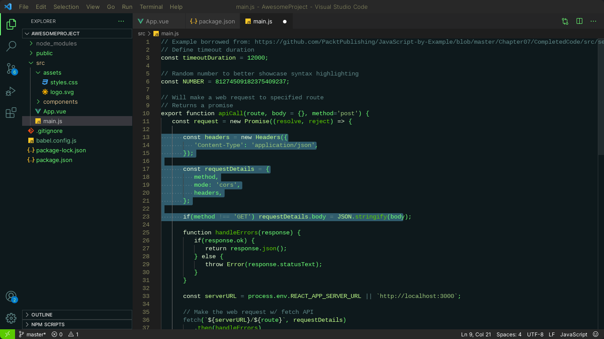

# VSCode Theme - Animatrix

## Description
Animatrix is a visually pleasing and user-friendly theme for Visual Studio Code that enhances your coding experience. It offers a balanced color palette and thoughtful design choices to make your code stand out while reducing eye strain.

## Features
- Clean and modern design
- Syntax highlighting for various languages
- Carefully selected color scheme
- Improved readability
- Minimal distractions

## Installation
1. Open Visual Studio Code.
2. Go to the Extensions view by clicking on the Extensions icon in the Activity Bar on the side of the window.
3. Search for "Animatrix" in the Extensions view search box.
4. Click the Install button to install it.
5. Choose "Animatrix" from the Color Theme drop-down menu in the Preferences > Color Theme settings.

## Screenshots

## Contributing
If you find any issues or have suggestions for improvements, please feel free to open an issue or create a pull request.
